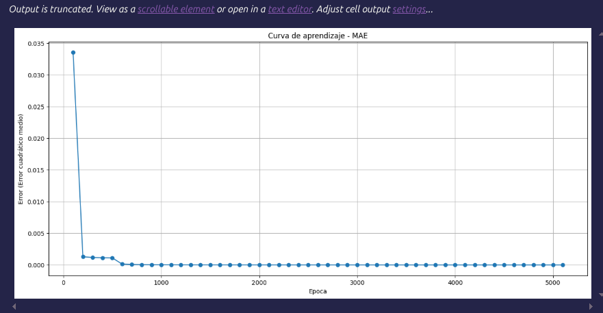
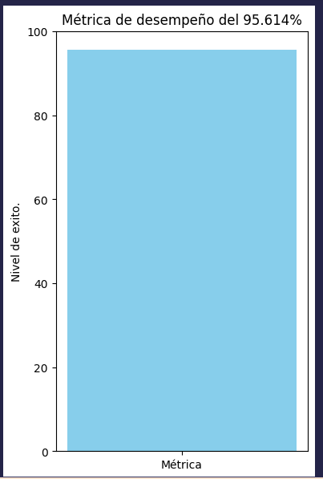

# Proyecto
- Entrenamiento de redes neuronales con una red neuronal hecha por mi mismo en el curso de redes neuronales, con dataset de cancer, iris y vino. 

# Proposito 
- El proposito de este primer o primeros proyectos es entender como funciona y se implementa una red neuronal sin la necesidad de usar alguna herramienta externa como pyTorch o tensorFlow. Esto para entender y estudiar como aprender una red y su arquitectura basica.

# Arquitectura
- 1 capa oculpa con salida binaria.

#  Tecnologías utilizadas
- Python
- NumPy (cómputo numérico)
- Pandas (manejo y análisis de datos)
- Matplotlib (visualización de resultados)

# Contexto académico 
- Nombre del estudiante: Fernando Octavio Arroyo Velasco.
- Nombre del maestro: Sabino Miranda Jimenez.
- Nombre de la materia: Redes neuronales.

# Modo de uso
- Para podes usar el proyecto, solo debe configurar la celda de "main" la celda llamada "El top" y la celda llamada "Replicamos la operacion unitaria".
- Para la celda llamada "main" solo debemos de cambiar la variable "nombre_dataset" por el nombre del dataset que queramos entrenar, recuerde que hay solo 3 opciones: cancer, iris y wine.
- Para la celda llamada "El top" el cual tiene solo dos opciones el "mejor" y "peor" con ello puede ver el top de la opcion que ingreso.
- Para la celda llamada "Replicamos la operacion unitaria" en esta podemos replicar el top ya sea mejor o peor de nuestros entrenamientos, las variables son las primeras variables que aparecen en la celda.

# Como bajarlo 
- Clone el repositorio con el comando **git clone: https://github.com/octaviioViego/redes_neuronales_entrenamiento_basico.git**
- Obtenga la extención de **Google colab** en su vsCode
- Al seleccionar el kenner de ejecución eliga la opción **colab** y siga los pasos que recomienda **Google colab** (ingresar cuenta si es que no la a ingresado). 
  
# Extra
- Es importante que sepa que este proyecto se adapto para que trabaje en colaboración de **Google colab** (extrencion de google colab y vs Code) y si usten no quiere usar **Google colab** y trabajar en su propia maquina puede que necesite configurar el modo en que se leen los dataset y el modo donde se guarden los resultados (los .csv) para poder extraerlos de su propia maquina o donde este trabajando.

# Tip 
- En la Red neuronal tiene comentada un pedazo de código que yo lo uso como bander para que en ciertas epocas si no evoluciona el error favorablemente este se detenga y continue con el siguiente. Tu como usuario tendras que usarlo o no de acuerdo a como veas que el error evoluciona y así crear una eficiencia en la red neuronal y solo las mejores convinaciones se entrenen con las TODAS las epocas.
 
# Imagenes del los datos 

## Gráfica de error vs epoca 

## Metrica del entrenamiento

